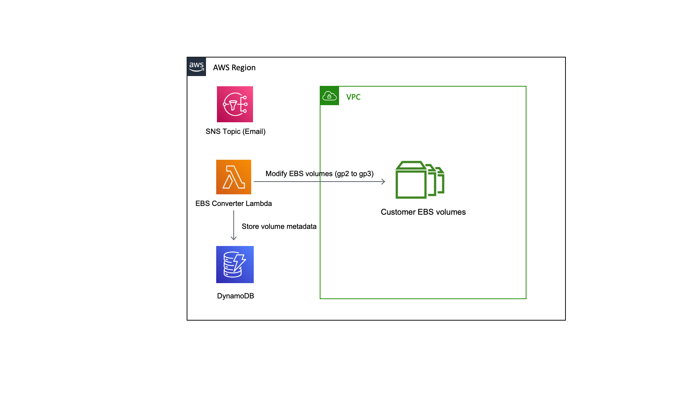
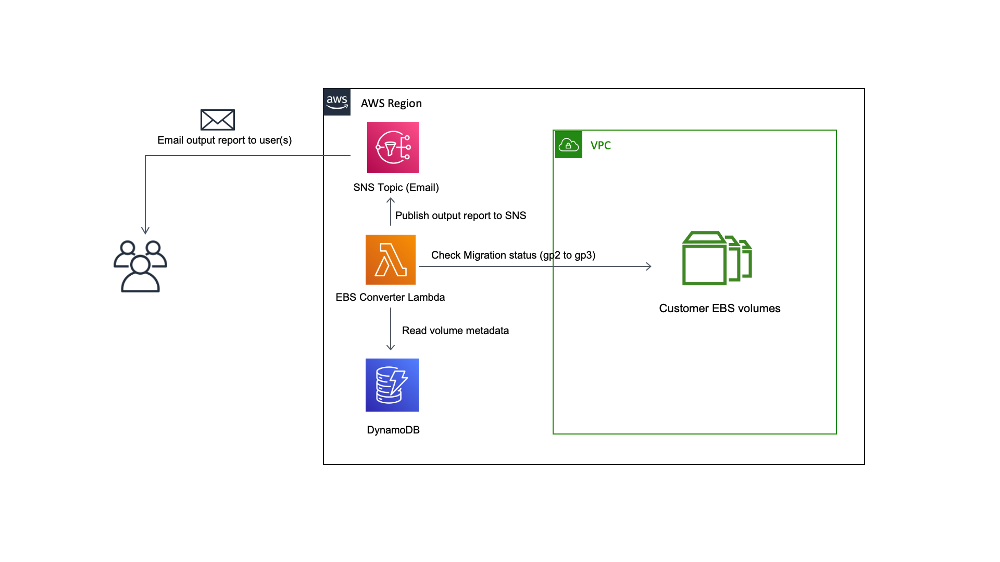

# Amazon EBS Migration Utility

This repository contains code that makes it easy for AWS customers to upgrade to the latest EBS gp3 volumes. By migrating to gp3, customer can save up to 20% lower price-point per GB than existing gp2 volumes.

## Getting Started

[sar-deploy]: https://img.shields.io/badge/Serverless%20Application%20Repository-Deploy%20Now-FF9900?logo=amazon%20aws&style=flat-square
[sar-logo]: https://img.shields.io/badge/Serverless%20Application%20Repository-View-FF9900?logo=amazon%20aws&style=flat-square

[![sar-logo]](https://serverlessrepo.aws.amazon.com/applications/arn:aws:serverlessrepo:us-east-1:065399810791:applications~amazon-ebs-migration-utility)

The easiest way to get started using the is to deploy this app from the [Serverless Application Repository](https://serverlessrepo.aws.amazon.com/applications/arn:aws:serverlessrepo:us-east-1:065399810791:applications~amazon-ebs-migration-utility). Once deployed, check the CloudFormation console to find the list of resources that have been deployed to your account. At a mimimum you will find a Lambda function, DynamoDB table, SNS Topic, IAM role and IAM policy created. *Do not* invoke the Lambda function until you've read this entire README.

As part of deploying this stack, you will need to provide a valid email address that will be used to send the results summary of the upgrade from gp2 to gp3. You will receive a confirmation email from AWS Notifications (no-reply@sns.amazonaws.com) once the stack has been deployed. You will need to click the link in the email to confirm your email subscription. You will not be able to receive the output results from the Lambda until you confirm your email subscription.

## Key Details (Do not skip this section)

> IMPORTANT: Please note that upon execution, this Lambda powered utility by default will upgrade **ALL** gp2 EBS volumes in your account to gp3. If you need to back out, there is no easy button in this version of the application. If you need to revert back from gp3 to gp2 this will have to be done manually. You can [modify](https://docs.aws.amazon.com/AWSEC2/latest/UserGuide/requesting-ebs-volume-modifications.html) your volume(s) using the Console/CLI/SDK. In some cases, the modify volume operation may fail and you may need to wait for 6 hours before you can modify your volume(s) back to gp2. For more details please see the limitations [here](https://docs.aws.amazon.com/AWSEC2/latest/UserGuide/modify-volume-requirements.html#elastic-volumes-limitations).

There will be no changes made to any of your other EBS volume types like io1, io2, sc1, st1, etc. If you have any gp2 EBS volumes that you don't want upgraded, you will need to tag each EBS volume with the key **upgrade_to_gp3** and set the value to ***no*** or ***false***. This will make the Lambda code skip those volumes and they will be untouched.

You will need to execute your Lambda function at least two times. You can invoke the Lambda function by clicking the invoke button from the AWS console or by directly calling the [Lambda invoke](https://docs.aws.amazon.com/lambda/latest/dg/API_Invoke.html) API. The first time you invoke the Lambda, it will go off and upgrade all gp2 volumes that do not have the tag **upgrade_to_gp3** set to ***no*** or ***false***.

 Depending on how many and how large your gp2 volumes are, the Lambda may take anywhere from a few seconds to a couple of minutes to complete. Please wait at least 60 seconds before invoking the Lambda function again. There is no limit to the number of times you can invoke your Lambda function. As mentioned earlier, the first execution will kick off the upgrade from gp2 to gp3.  The subsequent runs after the first run will do a status check on the state of your gp2/gp3 volumes and will send out an email (via SNS) with a summary of the results.

 

## Deployment

The easiest way to deploy this stack is from the [AWS Serverless Application Repository](https://serverlessrepo.aws.amazon.com/applications/arn:aws:serverlessrepo:us-east-1:065399810791:applications~amazon-ebs-migration-utility). You can also use the the SAM CLI to [deploy](https://docs.aws.amazon.com/serverless-application-model/latest/developerguide/sam-cli-command-reference-sam-deploy.html) at scale across multiple AWS accounts and in differnet AWS regions.

## Next Steps

We are actively iterating on this program to add more features and functionality.  We'd love to get your input and hear from you. Please create any Github issues for additional features you'd like to see.

## License

This library is licensed under the MIT-0 License. See the LICENSE file.
